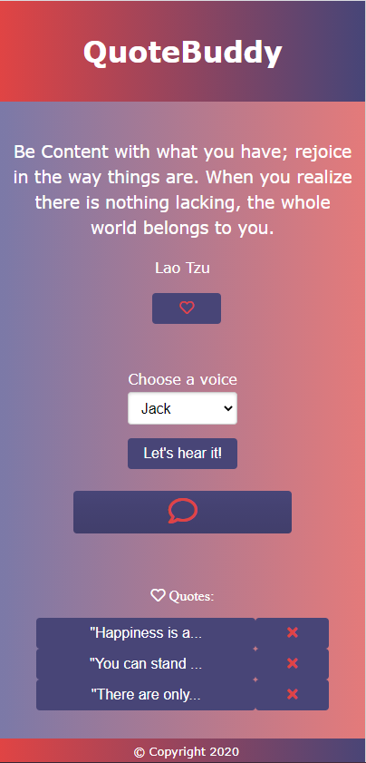

### QuoteBuddy

## Description

User can randomly generate a quote that will be spoken via text-to-voice. Accent can be chosen as well.

## User Story

As a person who seeks support at times

I want a way to hear random thoughtful quotes in various accents

So that I can feel inspired and motivated

## Technologies Used

HTML, CSS, JavaScript, JQuery

Forismatic Quote API

Voice RSS Text to Speech API

Local Storage

Pure CSS Framework

Github version control

## Collaborators

Lindsey Bordner https://github.com/LindseyM20

Carl Koepke https://github.com/Carl-33

Joshua Illg https://github.com/jishllg

## License:

The Unlicense
